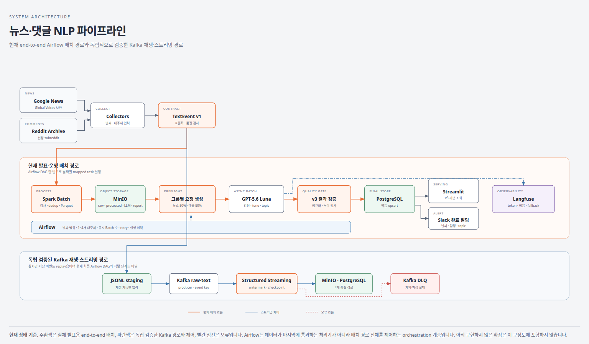

# 뉴스 및 댓글 NLP 데이터 파이프라인

## 해결하려는 문제

뉴스와 커뮤니티 댓글은 형식, 생성 속도와 품질이 서로 다릅니다. 이 프로젝트는 두 출처의 텍스트를 같은 기준으로 비교할 수 있도록 다음 데이터 엔지니어링 문제를 해결합니다.

- 서로 다른 원본을 하나의 `TextEvent v1` 계약으로 표준화
- Kafka로 수집과 처리 속도를 분리하고 과거 데이터를 재생
- Spark로 계약 검사, 품질 판정, event-time 중복 제거와 경로 분기
- checkpoint와 PostgreSQL batch commit으로 재시작 시 중복 적재 방지
- LLM Batch 분석의 상태·오류·토큰·비용을 추적하고 관측 장애를 격리

최종 목표는 공통 키워드·토픽과 시간 window를 기준으로 뉴스 보도와 커뮤니티 반응의 감정·토픽 변화를 비교하는 것입니다.

## 데이터

| 출처 | 사용하는 범위 | 분석 텍스트 | 현재 검증 |
|---|---|---|---|
| [Google News](https://news.google.com/) | 2012년 영어 검색 결과의 제목·게시일·언론사·URL | 기사 제목 | 366일 28,994건 일별 저장, 100건 도달 요청 3개 기록 |
| [Pushshift Reddit Comments](https://huggingface.co/datasets/fddemarco/pushshift-reddit-comments) | 댓글 ID, 본문, 작성 시각, subreddit, score | 작성자를 제외한 댓글 본문 | 2012년 원본 12개월·239,814,057건 다운로드와 크기 검증 완료 |
| [Global Voices](https://globalvoices.org/) | 2012-01-01~2016-02-29 영어 아카이브 제목·게시일·URL | 기사 제목 | Google News 보완용 공식 아카이브 Spider 검증 완료 |

두 출처를 기사 단위로 직접 조인하지 않습니다. 실제 원문과 실행 산출물은 Git에 포함하지 않고, `analysis/`에는 공개 가능한 명세·집계·검증 결과만 저장합니다.

## 전체 흐름 — 파이프라인 개요

```text
Google News · Global Voices(보완) · Reddit
→ Collector
→ TextEvent v1 계약 검증
→ JSONL staging
→ Kafka raw-text
→ Spark Structured Streaming
   ├─ 계약 오류 → contract_rejected + Kafka DLQ
   ├─ 품질 거부 → quality_rejected
   ├─ 격리 대상 → quarantine
   └─ 정상·flag → processed
→ partitioned Parquet + PostgreSQL 멱등 upsert
→ MinIO S3-compatible object storage             [서비스 기반 추가, 데이터 연동 예정]
→ GPT-5.6 Luna Batch 감정·토픽·요약              [일별 31건 + 월간 1건 완료·검증]
→ Langfuse token·비용 관측 + 구조화 로그 fallback
→ Airflow parameterized batch orchestration
```

Spark는 Standalone Master·Worker 구조로 실행하며, 별도의 `spark-runner`가 `spark-submit`과 Driver 역할을 담당합니다.



## 구현 상태

| 영역 | 상태 | 검증 근거 |
|---|---|---|
| 웹 뉴스·Reddit Collector | 구현 완료 | Google News 2012년 28,994건, Reddit 2012년 원본 12개월 검증 |
| `TextEvent v1`·JSON Schema | 구현 완료 | Python 계약과 JSON Schema 일치 |
| 데이터셋 명세·메타데이터 | 구현 완료 | GDELT·Reddit 명세, YAML 카탈로그와 profile |
| 텍스트 품질·안전 기준 | 구현 완료 | Unicode·반복·URL·PII·과대 입력 fixture 19개 |
| Kafka ingestion | 구현·통합 검증 완료 | 실제 Broker에 합성 1,000건 발행·소비 |
| Spark batch | 구현·검증 완료 | 동일 코드로 100건·1,000건 처리와 행 회계 확인 |
| Spark Structured Streaming | 구현·통합 검증 완료 | watermark 중복 제거, checkpoint 재시작, 4개 경로와 DLQ |
| Spark Standalone | 구현·통합 검증 완료 | Master·Worker 분리, Worker Executor 2 cores 실행 |
| PostgreSQL 적재 | MVP 구현·통합 검증 완료 | 정상 981건·계약 거부 1건, 새 checkpoint 재처리 중복 0건 |
| 부하·장애 복구 | 로컬 실험 완료 | 1월 2,935,785건 처리 복구 누락·중복 0건, DB 연결 실패 후 200건 멱등 복구 |
| MinIO object storage | 서비스 기반 구현 | Compose·bucket 자동 생성 추가, 실제 Spark `s3a://` 연동 전 |
| LLM Batch | 일별·월간 분석과 결과 검증 완료 | 71,842개 원문으로 일별 31건과 월간 1건 분석, 실패·누락·중복 0건, 총비용 `$0.5482444` |
| LLM 결과 품질 | quality gate 구현·실행 완료 | 일별 31행 보존·비정상 label 10개 제외, 월간 label 13개 모두 통과, hash 기록 |
| Langfuse | Cloud·fallback·실제 usage 검증 완료 | 일별 31건과 월간 1건 token·cost 대조 일치; primary 장애 시 구조화 로그 9건 보존 |
| Airflow orchestration | 수집·처리·LLM 준비 통합 검증 완료 | 단일 DAG에서 Reddit 100건→Spark 100건→LLM 요청 10건 dry-run 성공 |
| LLM PostgreSQL 적재 | 실제 멱등 적재 완료 | Batch·request·analysis 각 32행, 동일 입력 재실행 후 행 수 불변 |

현재 자동 테스트는 LLM 저장과 Airflow 통합 테스트를 포함합니다. PostgreSQL의 Spark 적재는 1,000건 규모의 Driver chunk upsert 방식이며, 대규모 확장에서는 JDBC staging 또는 bulk load로 교체할 예정입니다.

## 저장소 구조

```text
news-comment-nlp-pipeline/
├── collectors/                  # Google News·웹 뉴스·Reddit 수집과 공통 이벤트 변환
├── core/                        # 이벤트 계약과 텍스트 품질 규칙
├── producers/                   # Kafka 메시지 발행
├── jobs/                        # 토픽 초기화·replay·검증 CLI
├── spark_jobs/                  # batch·Structured Streaming Spark Job
├── storage/                     # JSONL과 PostgreSQL 저장 adapter
├── observability/               # Langfuse·구조화 로그·no-op 관측 adapter
├── llm_analysis/                # GPT-5.6 Luna Batch 요청·API client·결과 검증
├── orchestration/               # Airflow에서 재사용하는 실행·검증 helper
├── dags/                        # 파라미터형 Airflow DAG
├── sql/migrations/              # PostgreSQL 순차 migration
├── infra/spark/                 # Spark 제출 이미지
├── infra/airflow/               # Airflow·Java·PySpark 실행 환경
├── docs/architecture/           # MinIO를 포함한 시스템·저장 설계
├── sample/                      # JSON Schema와 공개 합성 이벤트
├── analysis/                    # 데이터셋 명세·품질 fixture·검증 보고서
├── tests/                       # 단위·Spark 변환·저장 테스트
├── docs/                        # 설계·구현·운영 문서
├── docker-compose.yml           # Kafka·Spark Standalone·PostgreSQL
└── requirements.txt
```

## 상세 문서 링크

| 문서 | 내용 |
|---|---|
| [문서 분류 안내](docs/README.md) | 아키텍처·가이드·브리핑·계획 문서 탐색 |
| [로컬 개발과 실행 가이드](docs/guides/getting-started.md) | 환경 준비, 테스트, 서비스 시작과 Job 제출 |
| [기술 스택과 역할](docs/architecture/technology-stack.md) | 구성 요소의 책임, 선택 이유와 확장 지점 |
| [Date 4 Kafka·Spark 정리](docs/briefings/date4.md) | 메시지 명세, 1,000건 검증, 전처리·저장과 실행 명령 |
| [Date 5 Airflow 자동화 브리핑](docs/briefings/date5/date5.md) | 과제 요구사항, DAG 구조, 두 번의 파라미터 실행과 제출 자료 |
| [Date 6 부하·장애·복구](docs/briefings/date6/date6.md) | 2012년 수집, 입력 확대, Spark·PostgreSQL 장애 복구 결과 |
| [6차시 보완·전체 흐름 점검](docs/briefings/date7/date7.md) | 부하 비교, fallback·alert, LLM Batch와 기술 확장 범위 |
| [경제·사회 1월 LLM 최종 결과](docs/briefings/date7/economy-social-results-01-31.md) | 일별 31건의 입력·시간·token·비용·감성·주제와 품질 점검 |
| [시스템 구성도](docs/architecture/system-architecture.html) | 전체 목표 아키텍처 |
| [Ingestion 구현 설명](docs/guides/ingestion-implementation.md) | Collector부터 Kafka 적재 확인까지의 코드 흐름 |
| [Scrapy 웹 뉴스 수집](docs/guides/web-news-collection.md) | 기간·키워드 실행, 책임 분리, 요청 정책과 검증 방법 |
| [TextEvent v1 데이터 계약](docs/architecture/data-contract.md) | 공통 Schema와 출처별 필드 매핑 |
| [데이터셋 명세와 메타데이터](analysis/README.md) | 데이터 출처·범위·카탈로그와 공개 가능 profile |
| [실제 표본 검증](docs/reports/validation-report.md) | Reddit 100건과 GDELT 확인 상태 |
| [Global Voices 소량 검증](analysis/reports/global-voices-smoke-validation.md) | robots 준수, 실제 요청 수와 5건 계약 검증 결과 |
| [텍스트 품질·안전 규칙](analysis/quality/text-quality-rules.md) | 품질 측정값·임계값·상태와 출력 규격 |
| [Spark batch 검증](analysis/reports/spark-batch-validation.md) | 100건·1,000건 행 회계와 품질 분포 |
| [Spark 운영 로그 점검](analysis/reports/spark-run-log-review.md) | 1,000건 단계별 시간·행 회계·payload 미기록 검사 |
| [Spark Standalone 실행 구조](docs/guides/spark-standalone.md) | Master·Worker·Driver 역할과 제출 명령 |
| [Spark Streaming Consumer](docs/guides/spark-streaming-consumer.md) | Kafka 입력, watermark, checkpoint, DLQ와 sink |
| [Spark Streaming 통합 검증](analysis/reports/spark-streaming-consumer-validation.md) | 실제 Kafka 처리와 checkpoint 재시작 결과 |
| [PostgreSQL 저장 구조](docs/architecture/storage-schema.md) | 핵심 테이블, migration과 transaction upsert |
| [MinIO Object Storage 설계](docs/architecture/object-storage.md) | 로컬 S3 호환 bucket, 현재 범위와 Spark 연동 순서 |
| [PostgreSQL 통합 검증](analysis/reports/postgres-integration-validation.md) | 982건 적재, rollback·재시도와 멱등성 결과 |
| [LLM PostgreSQL·Airflow 통합 검증](analysis/reports/llm-postgres-airflow-integration-validation.md) | 실제 LLM 32건 멱등 적재와 수집→Spark→LLM 단일 DAG 실행 결과 |
| [데이터와 보안 원칙](docs/security/data-security.md) | 원문·PII·자격 증명·보존과 외부 전송 기준 |
| [LLM 분석 설계](docs/architecture/llm-analysis-design.md) | Batch 분석과 Langfuse 관측 계획 |
| [OpenAI API·Langfuse 구성 기록](docs/briefings/date7/openai-langfuse-setup.md) | 실제 프로젝트·환경변수·Airflow 반영과 검증 결과 |
| [Langfuse 도입 ADR](docs/adr/0001-langfuse-deployment.md) | 관리형·self-hosted 비교, 데이터 경계와 adapter 결정 |
| [Langfuse 구현·토큰 관리 계획](docs/planning/langfuse-implementation-plan.md) | adapter 구조, token·비용 대조, 예산과 검증 계획 |
| [Langfuse 샘플 추적 검증](analysis/reports/langfuse-token-validation.md) | 합성 3건의 token·비용·재시도와 metadata-only 결과 |
| [Airflow 자동화 실행 가이드](docs/guides/airflow-automation.md) | 서로 다른 두 날짜의 GDELT 수집·Spark 실행 절차 |
| [Airflow 과제 실행 검증](analysis/reports/airflow-assignment-validation.md) | 사전 검사와 실제 두 DAG run 결과 기록 |
| [장애·부하 테스트 계획](docs/planning/failure-and-load-test-plan.md) | 입력·서비스 장애와 부하 시나리오 |
| [구현 로드맵](docs/planning/roadmap.md) | 완료된 기반과 Langfuse·LLM·Airflow·확장 순서 |
| [피드백 구현 계획](docs/planning/feedback-implementation-plan.md) | 단계별 완료 조건과 진행 기록 |
