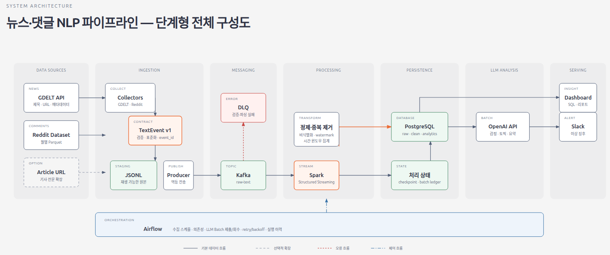

# 뉴스 및 댓글 NLP 데이터 파이프라인

GDELT 뉴스와 Reddit 댓글을 공통 이벤트로 수집하고 Kafka와 Spark로 처리한 뒤, LLM Batch API로 감정·토픽·요약을 분석하는 데이터 파이프라인 프로젝트입니다.

> 목표: 뉴스 보도와 커뮤니티 반응의 감정·토픽 변화를 시간대별로 비교할 수 있는 재현 가능하고 장애에 강한 파이프라인을 구축합니다.

## 프로젝트가 해결하려는 문제

뉴스와 커뮤니티 댓글은 형식, 생성 속도와 품질이 서로 다릅니다. 이 프로젝트는 모델 자체를 개발하는 대신 다음 데이터 엔지니어링 문제에 집중합니다.

- 서로 다른 출처를 하나의 데이터 계약으로 표준화
- 수집 속도와 처리 속도를 Kafka로 분리
- Spark를 이용한 정제, 중복 제거와 지연 이벤트 처리
- 비동기 LLM 분석의 상태·오류·토큰·비용 관측
- 재시작해도 유실과 중복을 통제할 수 있는 저장 구조

## 데이터

| 출처 | 사용하는 범위 | 분석 텍스트 |
|---|---|---|
| [GDELT DOC API](https://www.gdeltproject.org/) | 뉴스 URL, 제목, 언어, 도메인, 관측 시각 | MVP에서는 기사 제목 |
| [Pushshift Reddit Comments](https://huggingface.co/datasets/fddemarco/pushshift-reddit-comments) | 댓글 ID, 본문, 작성 시각, subreddit, score | 작성자 정보를 제외한 댓글 본문 |

두 출처를 기사 단위로 직접 조인하지 않습니다. 공통 키워드·토픽과 시간 window를 기준으로 뉴스 보도와 댓글 반응의 변화를 비교합니다.

필드 정의와 출처별 매핑은 [TextEvent v1 데이터 계약](docs/data-contract.md), 실제 표본 검증 결과는 [검증 보고서](docs/validation-report.md)에서 확인할 수 있습니다.

## 전체 흐름

```text
GDELT · Reddit
→ Collector
→ TextEvent v1 검증
→ JSONL staging
→ Kafka raw-text
→ Spark 정제·중복 제거·window
→ PostgreSQL
→ LLM Batch 분석
→ 감정·토픽·요약 결과
```



## 핵심 기술

| 기술 | 역할 |
|---|---|
| Python | Collector, Kafka job과 LLM worker |
| Apache Kafka | 이벤트 버퍼와 과거 데이터 replay |
| Apache Spark | Schema parsing, 정제, 중복 제거와 시간 window |
| PostgreSQL | 원본·정제·분석 결과와 처리 상태 저장 |
| OpenAI Batch API | 감정, 토픽, 키워드와 요약 생성 |
| Langfuse | LLM 토큰·비용·지연 관측 도입 검토 |
| Apache Airflow | 스케줄, 작업 의존성과 재시도 예정 |
| Docker Compose | 로컬 서비스 실행 환경 |

## 현재 구현 상태

| 영역 | 상태 |
|---|---|
| GDELT·Reddit Collector | 구현 완료 |
| `TextEvent v1`·JSON Schema | 구현 완료 |
| JSONL staging·Kafka replay | 구현 완료 |
| Kafka Producer·토픽 초기화·검증 Consumer | 구현 완료, 실제 Broker 통합 검증 필요 |
| Spark 100·1,000건 처리 | 다음 구현 단계 |
| PostgreSQL 적재 | 설계 단계 |
| LLM Batch·Langfuse | 설계·도입 검토 단계 |
| Airflow orchestration | 계획 단계 |

현재 구현과 목표 아키텍처를 구분합니다. Kafka 이후 Spark, PostgreSQL, LLM과 Airflow는 README의 전체 흐름에는 포함되지만 아직 모두 구현된 상태는 아닙니다.

## 빠른 시작

### 1. 환경 준비

```bash
python3 -m venv .venv
source .venv/bin/activate
python3 -m pip install -r requirements.txt
```

### 2. 테스트

```bash
python3 -m pytest -q
```

### 3. 공개 합성 이벤트로 Kafka Ingestion 확인

```bash
docker compose up -d kafka
python3 -m jobs.init_kafka
python3 -m jobs.replay_to_kafka \
  --input sample/synthetic-events.jsonl
python3 -m jobs.inspect_kafka \
  --topic raw-text \
  --from-beginning \
  --group-id ingestion-check-1 \
  --limit 10
```

Docker 권한과 Kafka Broker가 필요합니다. 자세한 Collector·Kafka 옵션과 코드 흐름은 [Ingestion 구현 설명](docs/ingestion-implementation.md)을 참고합니다.

### 4. 데이터 수집 예시

```bash
python3 -m collectors.gdelt \
  --query "climate change" \
  --max-records 100 \
  --output data/raw/gdelt.jsonl

python3 -m collectors.reddit \
  --month 2016-01 \
  --subreddit worldnews \
  --limit 100 \
  --output data/raw/reddit.jsonl
```

## 저장소 구조

```text
news-comment-nlp-pipeline/
├── collectors/                  # GDELT·Reddit 수집과 공통 이벤트 변환
├── core/                        # TextEvent v1 검증과 공통 유틸리티
├── storage/                     # JSONL 저장
├── producers/                   # Kafka 메시지 발행
├── jobs/                        # 토픽 초기화·replay·적재 확인 CLI
├── sample/                      # JSON Schema와 공개 합성 이벤트
├── tests/                       # Collector·계약·Kafka 단위 테스트
├── docs/                        # 상세 설계·구현·검증 문서
├── docker-compose.yml
└── requirements.txt
```

## 상세 문서

| 문서 | 내용 |
|---|---|
| [시스템 구성도](docs/system-architecture.html) | 전체 목표 아키텍처 |
| [Ingestion 구현 설명](docs/ingestion-implementation.md) | Collector부터 Kafka 적재 확인까지의 코드 흐름 |
| [TextEvent v1 데이터 계약](docs/data-contract.md) | 공통 Schema와 출처별 필드 매핑 |
| [실제 표본 검증](docs/validation-report.md) | Reddit 100건 검증과 GDELT 확인 상태 |
| [PostgreSQL 저장 구조](docs/storage-schema.md) | 목표 테이블과 적재·멱등성 설계 |
| [LLM 분석 설계](docs/llm-analysis-design.md) | Batch 분석, 결과 검증과 Langfuse 관측 계획 |
| [장애·부하 테스트 계획](docs/failure-and-load-test-plan.md) | 잘못된 입력과 서비스 장애 시나리오 |
| [피드백 구현 계획](docs/feedback-implementation-plan.md) | README·데이터 명세·Spark·Langfuse 단계별 진행 상황 |

## 데이터와 보안 원칙

- 실제 기사·댓글 원문과 생성된 `data/` 파일은 Git에 포함하지 않습니다.
- Reddit 작성자와 사용자 식별값을 공통 이벤트에 저장하지 않습니다.
- `.env`, API key, 비밀번호와 webhook을 커밋하지 않습니다.
- 외부 LLM에는 정제·비식별화한 분석 대상 텍스트만 전달합니다.
- 기사 전문 수집은 저작권, 이용약관과 robots 정책을 검토한 뒤 선택적으로 확장합니다.

## 향후 순서

1. 데이터셋 명세와 기계 판독 메타데이터 작성
2. 도배·Unicode·과대 입력 품질 기준과 fixture 작성
3. Spark로 100건, 이후 1,000건 이상 처리
4. Kafka Structured Streaming과 PostgreSQL 적재
5. Langfuse 도입 방식 결정 및 LLM Batch 추적
6. Airflow와 장애·부하 테스트
