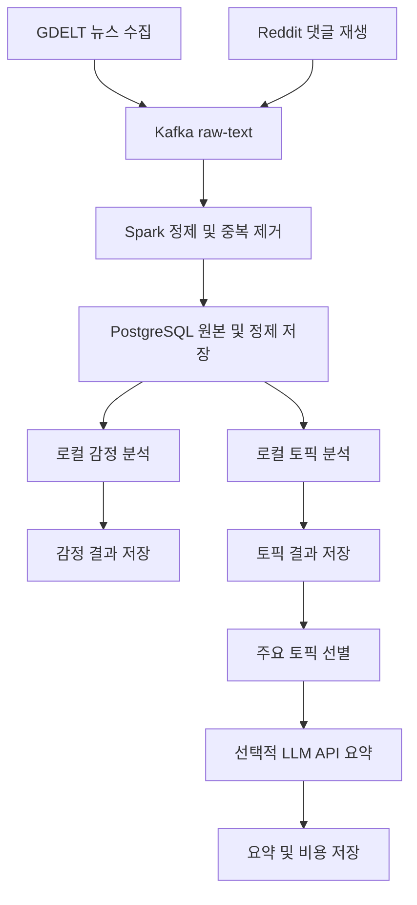

# 뉴스 및 댓글 텍스트 감정 및 토픽 분석 파이프라인

## 프로젝트 소개

GDELT 뉴스와 Reddit 댓글을 Kafka로 수집하고 Spark Structured Streaming으로 정제한 뒤, 로컬 NLP 모델로 감정과 토픽을 분석해 PostgreSQL에 저장하는 데이터 파이프라인 프로젝트입니다.

로컬 NLP 모델이 전체 텍스트의 감정 분석과 토픽 분석을 담당합니다. LLM API는 핵심 분석에 필수로 사용하지 않고, 주요 토픽의 이름과 요약을 만드는 선택 기능으로만 사용합니다. 따라서 API가 중단되거나 예산을 초과해도 데이터 수집과 핵심 분석은 계속 동작합니다.

---

## 1. 프로젝트 목표 한 줄

> 뉴스와 Reddit 댓글의 감정과 토픽 변화를 비교할 수 있는 스트리밍 NLP 데이터 파이프라인을 구축한다.

동일한 사회 이슈에 대해 뉴스 보도량과 Reddit 댓글의 감정 및 토픽이 시간에 따라 어떻게 달라지는지 분석하는 것이 핵심 목표입니다.

## 2. 주제 선정 이유

- 뉴스와 댓글은 지속해서 생성되므로 Kafka 기반 스트리밍 수집의 필요성이 분명합니다.
- 텍스트에는 빈 문서, 중복, 지연, 서로 다른 언어와 형식 등 다양한 품질 문제가 있어 Spark를 이용한 정제 과정을 보여주기 좋습니다.
- 뉴스 보도량과 댓글 반응을 시간대와 토픽 단위로 비교하면 단순 수집을 넘어 활용 가능한 분석 결과를 만들 수 있습니다.
- 감정 분석과 토픽 분석을 로컬 NLP 모델로 처리하면 대량의 문서를 외부로 보내지 않고 비용도 절감할 수 있습니다.
- LLM API를 선택적으로 연결하면 토픽 이름과 요약의 가독성을 높이는 동시에 요청 수, 토큰 수, 비용까지 관리하는 구조로 확장할 수 있습니다.
- Kafka, Spark, PostgreSQL의 장애와 복구, 중복 처리, 지연 데이터 처리 과정을 실험하기에 적합합니다.

## 3. 사용할 데이터와 출처

### 3.1 뉴스 데이터

- 출처: [GDELT Project](https://www.gdeltproject.org/)
- 수집 후보: GDELT DOC API 또는 GDELT 공개 데이터
- 수집 주기 후보: 15분
- 사용할 정보: 뉴스 제목, URL, 언론사 도메인, 언어, 게시 시각, 검색 키워드, 수집 시각

기사 전문을 무단으로 크롤링하지 않고 GDELT가 제공하는 제목과 메타데이터를 중심으로 사용합니다. GDELT가 제공하는 기존 감정 및 주제 정보는 직접 만든 분석 결과와 비교하기 위한 참고값으로만 활용합니다.

### 3.2 댓글 데이터

- 출처: [Hugging Face Pushshift Reddit Comments](https://huggingface.co/datasets/fddemarco/pushshift-reddit-comments)
- 데이터 형식: Parquet
- 사용할 정보: 댓글 ID, 작성 시각, 커뮤니티, 댓글 본문, 점수, 상위 게시물 또는 댓글 ID
- 스트리밍 방식: 과거 댓글을 원래 작성 시각 순서대로 Kafka에 재생

전체 데이터는 약 18억 4,596만 행, 약 292GB입니다(데이터셋 페이지 확인일: 2026-08-13). 전량을 다운로드하지 않고, MVP에서는 분석 주제와 관련된 커뮤니티 3개에서 5개, 기간 1개월에서 3개월 정도의 표본만 사용합니다.

작성자 정보는 수집 단계에서 제거하거나 해시합니다. 공개 저장소에는 실제 댓글 원문과 사용자 식별값을 올리지 않습니다.

### 3.3 데이터 결합 기준

뉴스와 Reddit 댓글이 반드시 같은 기사에 연결되는 것은 아닙니다. 따라서 기사별로 직접 조인하지 않고 다음 기준으로 비교합니다.

두 데이터는 동일 문서 간 관계를 찾기 위한 것이 아니라, 공통 이슈에 대한 뉴스 보도와 대중 반응의 시간적 차이를 비교하기 위해 사용합니다.

- 공통 키워드
- 토픽 ID
- 15분, 1시간, 1일 시간 윈도우
- 뉴스와 댓글의 감정 비율
- 토픽별 뉴스 수와 댓글 수

## 4. 수집 → 처리 → 저장 흐름



### 단계별 처리 과정

1. Airflow가 GDELT 뉴스 수집과 Reddit 댓글 재생 작업을 실행합니다.
2. 각 Producer가 데이터를 공통 JSON 이벤트 형식으로 변환해 Kafka `raw-text` 토픽으로 전송합니다.
3. Spark Structured Streaming이 JSON 스키마와 이벤트 시각을 검사합니다.
4. Spark가 빈 텍스트 제거, 중복 제거, 개인정보 마스킹, 언어 구분을 수행합니다.
5. watermark를 적용해 늦게 도착한 이벤트를 정해진 범위까지 처리합니다.
6. `foreachBatch`가 원본 이벤트와 정제 문서를 PostgreSQL에 적재합니다.
7. 로컬 감정 분석 Worker가 미처리 문서를 읽고 긍정, 중립, 부정 점수를 저장합니다.
8. 토픽 분석 Worker가 유사한 문서를 군집화하고 토픽 ID와 대표 키워드를 저장합니다.
9. 시간 윈도우별 문서 수, 감정 비율, 토픽 점유율과 변화율을 집계합니다.
10. 급증한 주요 토픽은 선택적으로 LLM API에 전달해 토픽 이름과 요약을 생성합니다.
11. 모든 결과와 파이프라인 실행 이력을 PostgreSQL에 저장합니다.

## 5. 프로세스별 역할

| 프로세스 | 역할 | 실행 방식 |
|---|---|---|
| 뉴스 Collector | GDELT 뉴스 제목과 메타데이터 수집 | 15분 주기 후보 |
| 댓글 Replay Producer | 과거 댓글을 이벤트 시간 순서로 재생 | 테스트 또는 수집 기간에 실행 |
| Kafka | 수집 속도와 처리 속도를 분리하고 이벤트를 보관 | 상시 실행 |
| Spark Structured Streaming | 파싱, 정제, 중복 제거, watermark, 윈도우 집계 | 상시 실행 |
| PostgreSQL | 원본, 정제 문서, 분석 결과, 처리 상태 저장 | 상시 실행 |
| 감정 분석 Worker | 전체 문서의 긍정, 중립, 부정 분류 | 작은 배치로 지속 실행 |
| 토픽 분석 Worker | 문서 임베딩, 군집화, 대표 키워드 추출 | 주기적 배치 실행 |
| LLM API Worker | 주요 토픽 이름과 요약 생성 | 선택적 실행 |
| Airflow | 작업 예약, 의존성, 재시도, 실패 이력 관리 | 상시 실행 후보 |

Kafka, Spark, PostgreSQL은 핵심 데이터 파이프라인이므로 상시 실행합니다. 토픽 모델 재학습처럼 메모리를 많이 사용하는 작업은 실시간 경로에서 분리해 주기적으로 실행합니다.

## 6. 분석 방법

### 6.1 감정 분석

Hugging Face Transformers의 경량 분류 모델을 로컬에서 실행해 문서별 감정을 분석합니다.

```text
정제 텍스트
→ tokenizer
→ 감정 분류 모델
→ 긍정, 중립, 부정 확률
→ PostgreSQL 저장
```

영어 댓글에는 Twitter-RoBERTa 계열 모델을 우선 후보로 사용합니다. 여러 언어를 함께 처리할 경우 XLM-RoBERTa 계열 다국어 감정 모델을 검토합니다.

주요 결과는 다음과 같습니다.

- 문서별 감정 분류와 확률
- 시간대별 긍정, 중립, 부정 비율
- 뉴스와 댓글의 감정 차이
- 부정 반응 급증 구간

### 6.2 토픽 분석

MVP에서는 TF-IDF와 LDA를 기준 모델로 사용합니다. 확장 단계에서는 Sentence Transformer 임베딩과 BERTopic을 적용해 결과를 비교합니다.

| 방법 | 역할 | 특징 |
|---|---|---|
| TF-IDF | 문서별 주요 단어 계산 | 가볍고 구현이 단순함 |
| LDA | 단어 분포 기반 토픽 생성 | MVP 기준 모델로 적합함 |
| MiniLM | 문장을 의미 벡터로 변환 | 비교적 가볍고 군집화에 적합함 |
| BERTopic | 임베딩 기반 토픽 군집화 | 의미가 비슷한 문서를 묶기 좋음 |

BERTopic은 새 이벤트마다 다시 학습하지 않습니다. 최근 1만 건에서 3만 건을 대상으로 하루 한 번 재학습하고, 분석 중에도 Kafka와 Spark 수집 파이프라인은 계속 실행합니다.

주요 결과는 다음과 같습니다.

- 토픽 ID와 대표 키워드
- 토픽별 뉴스 수와 댓글 수
- 시간대별 토픽 점유율
- 새롭게 등장한 토픽
- 급상승하거나 사라지는 토픽

### 6.3 선택적 LLM API

LLM API는 전체 문서의 감정 분석이나 토픽 군집화에 사용하지 않습니다. 다음과 같은 일부 결과만 전달합니다.

- 급상승한 토픽
- 부정 반응이 크게 증가한 토픽
- 사람이 읽을 토픽 이름이 필요한 경우
- 대시보드나 보고서용 요약이 필요한 경우
- 로컬 모델의 품질을 확인하기 위한 소량 표본

API에는 토픽별 대표 키워드와 비식별화한 대표 문서만 전달합니다. 결과는 짧은 JSON으로 받고 요청 수, 입력 및 출력 토큰, 응답 시간, 오류 횟수와 예상 비용을 PostgreSQL에 기록합니다.

API가 실패하거나 예산을 초과하면 대표 키워드를 토픽 이름으로 사용합니다. 따라서 LLM API 없이도 핵심 파이프라인과 분석 결과는 정상적으로 동작합니다.

## 7. PostgreSQL 저장 구조 초안

MVP에서는 PostgreSQL을 영구 데이터 저장소로 사용합니다. 데이터 규모가 커질 경우 원본 이벤트는 객체 저장소로 분리하는 방안을 검토합니다.

```text
PostgreSQL
├── raw_text_events              # Kafka 원본 이벤트, JSONB
├── text_documents_clean         # 정제 및 비식별화 문서
├── document_sentiments          # 문서별 감정 결과
├── document_topics              # 문서와 토픽 연결
├── sentiment_window_metrics     # 시간대별 감정 집계
├── topic_window_metrics         # 시간대별 토픽 집계
├── topic_summaries              # 주요 토픽 이름과 요약
├── text_alert_events            # 급증 및 이상 이벤트
├── text_data_quality            # 결측, 중복, 지연 통계
├── llm_usage_ledger             # API 토큰과 비용 기록
├── stream_batch_commits         # Spark batch_id 중복 방지
└── pipeline_run_history         # 작업 실행 이력
```

원본 이벤트는 JSONB로 저장하고 정제 결과와 분석 결과는 관계형 테이블로 분리합니다. 대량 적재는 한 행씩 INSERT하지 않고 다음 방식으로 처리합니다.

```text
Spark foreachBatch
→ PostgreSQL staging 테이블
→ 트랜잭션 시작
→ INSERT ... ON CONFLICT
→ batch_id 기록
→ 트랜잭션 완료
```

## 8. 사용해보고 싶은 기술 후보

| 구분 | 기술 후보 | 용도 |
|---|---|---|
| 언어 | Python | 수집기와 분석 Worker 개발 |
| 뉴스 수집 | GDELT DOC API | 뉴스 제목과 메타데이터 수집 |
| 댓글 로딩 | Hugging Face Datasets, PyArrow | Reddit 표본 로딩 |
| 이벤트 전달 | Apache Kafka | 실시간 이벤트 버퍼 |
| 스트리밍 처리 | Apache Spark Structured Streaming | 정제, 중복 제거, 윈도우 처리 |
| 영구 저장소 | PostgreSQL, JSONB | 원본, 정제, 분석 결과 저장 |
| 감정 분석 | Hugging Face Transformers, OpenVINO | 로컬 감정 분류 |
| 토픽 분석 | TF-IDF, LDA, MiniLM, BERTopic | 키워드와 토픽 생성 및 비교 |
| 선택적 생성 모델 | LLM API | 주요 토픽 이름과 요약 |
| 워크플로 관리 | Apache Airflow | 예약, 의존성, 재시도 |
| 실행 환경 | Docker Compose | 서비스별 실행 환경 구성 |
| 알림 | Slack Webhook | 장애와 주요 토픽 알림 |
| 컨테이너 관리(선택적 확장) | Kubernetes | Worker 확장과 장애 실험 |

## 9. 공통 이벤트 스키마 초안

```json
{
  "event_id": "unique-id",
  "source_type": "news_or_comment",
  "source_name": "gdelt_or_reddit",
  "event_time": "2026-08-13T12:00:00Z",
  "collected_at": "2026-08-13T12:01:00Z",
  "language": "en",
  "title": "nullable-title",
  "text": "text-for-analysis",
  "url": "nullable-source-url",
  "community": "nullable-community",
  "engagement": 0,
  "schema_version": 1
}
```

## 10. 구현 범위

### MVP

- GDELT 뉴스 제목과 메타데이터 수집
- Reddit 댓글 표본 생성과 Kafka 재생
- Kafka 기반 이벤트 전달
- Spark 기반 파싱, 정제, 비식별화, 중복 제거
- watermark와 시간 윈도우 집계
- PostgreSQL 원본 및 정제 데이터 저장
- 로컬 감정 분석
- TF-IDF와 LDA 기반 토픽 분석
- 감정과 토픽 결과 조회용 SQL
- checkpoint 기반 Spark 재시작 검증

### 확장 기능

- MiniLM과 BERTopic을 이용한 토픽 분석 고도화
- 주요 토픽의 LLM API 이름 및 요약 생성
- API 토큰과 비용 원장 구축
- 부정 반응과 토픽 급증 Slack 알림
- Kafka Broker 장애와 복구 실험
- Kubernetes 기반 분석 Worker 확장

## 11. 로드 테스트와 장애 복구 계획

- 댓글 재생 속도를 1배, 10배, 100배로 높여 처리량과 Consumer Lag을 측정합니다.
- 동일 ID와 동일 텍스트를 반복 전송해 중복 제거를 확인합니다.
- 빈 텍스트, 잘못된 JSON, 누락된 시각과 지나치게 긴 문서를 주입합니다.
- 순서를 섞은 지연 이벤트로 watermark 전후 결과를 비교합니다.
- Spark를 중단한 뒤 같은 checkpoint로 재시작해 미처리 이벤트가 복구되는지 확인합니다.
- PostgreSQL 연결을 중단한 뒤 동일 `batch_id`를 재실행해 중복 적재 여부를 확인합니다.
- 감정 또는 토픽 Worker를 중단한 뒤 `pending` 문서부터 다시 처리되는지 확인합니다.
- LLM API 오류와 예산 초과 시 키워드 기반 대체 결과가 사용되는지 확인합니다.

## 12. 기대 결과

- 뉴스와 댓글을 공통 스키마로 수집하는 데이터 파이프라인
- 정제하고 비식별화한 텍스트 데이터
- 시간대별 긍정, 중립, 부정 비율
- 토픽별 뉴스와 댓글 수 및 점유율
- 새롭게 등장하거나 급상승한 토픽
- 뉴스 보도와 댓글 반응의 차이
- 주요 토픽의 선택적 자연어 요약
- 중복, 지연, 장애 후 복구 결과
- LLM API 요청량과 예상 비용 기록

## 13. 저장소 구성 초안

```text
news-comment-nlp-pipeline/
├── README.md
├── docker-compose.yml
├── requirements.txt
├── .env.example
├── dags/
├── collectors/
├── producers/
├── spark/
├── nlp/
├── llm/
├── sql/
├── tests/
├── sample/
│   └── schema.json
└── docs/
    ├── architecture.md
    └── cost-design.md
```

## 14. 공개 저장소 주의사항

- 기사 전문과 실제 댓글 원문을 커밋하지 않습니다.
- 작성자 정보와 사용자 식별값을 커밋하지 않습니다.
- PostgreSQL 데이터 볼륨과 Spark checkpoint를 커밋하지 않습니다.
- `.env`, PostgreSQL 비밀번호, LLM API 키와 Slack Webhook을 커밋하지 않습니다.
- 공개 저장소에는 수집 코드, 데이터 생성 또는 표본 추출 코드, 스키마와 합성 샘플만 올립니다.
- 데이터 출처, 사용 범위, 보관 기간과 비식별화 방식을 기록합니다.
