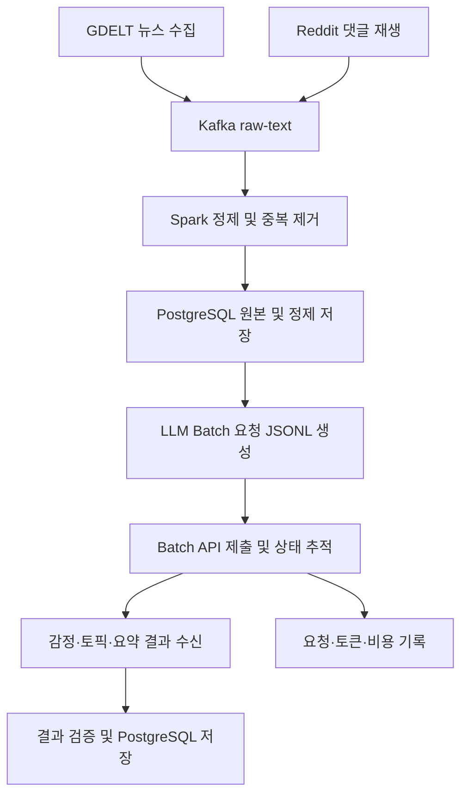

# 뉴스 및 댓글 텍스트 감정 및 토픽 분석 파이프라인

## 프로젝트 소개

GDELT 뉴스와 Reddit 댓글을 Kafka로 수집하고 Spark Structured Streaming으로 정제한 뒤, LLM Batch API로 감정과 토픽을 분석해 PostgreSQL에 저장하는 데이터 파이프라인 프로젝트입니다.

프로젝트의 중심은 NLP 모델을 직접 개발하는 것이 아니라 수집, 정제, API 요청 생성, 비동기 작업 추적, 결과 적재와 재처리까지 이어지는 데이터 파이프라인 구축입니다. 감정 분류, 토픽 추출과 요약은 LLM API가 담당하며, 즉시 응답이 필요하지 않은 분석은 Batch API로 묶어 비용을 절감합니다.

---

## 1. 프로젝트 목표 한 줄

> 뉴스와 Reddit 댓글의 감정과 토픽 변화를 비교할 수 있는 스트리밍 NLP 데이터 파이프라인을 구축한다.

동일한 사회 이슈에 대해 뉴스 보도량과 Reddit 댓글의 감정 및 토픽이 시간에 따라 어떻게 달라지는지 분석하는 것이 핵심 목표입니다.

## 2. 주제 선정 이유

- 뉴스와 댓글은 지속해서 생성되므로 Kafka 기반 스트리밍 수집의 필요성이 분명합니다.
- 텍스트에는 빈 문서, 중복, 지연, 서로 다른 언어와 형식 등 다양한 품질 문제가 있어 Spark를 이용한 정제 과정을 보여주기 좋습니다.
- 뉴스 보도량과 댓글 반응을 시간대와 토픽 단위로 비교하면 단순 수집을 넘어 활용 가능한 분석 결과를 만들 수 있습니다.
- 감정 및 토픽 모델 개발보다 데이터 파이프라인의 신뢰성과 운영 구조에 집중할 수 있습니다.
- LLM Batch API를 이용하면 대량의 텍스트를 비동기로 처리하면서 요청 수, 토큰 수와 비용을 함께 관리할 수 있습니다.
- Kafka, Spark, PostgreSQL의 장애와 복구, 중복 처리, 지연 데이터 처리 과정을 실험하기에 적합합니다.

## 3. 사용할 데이터와 출처

### 3.1 뉴스 데이터

- 출처: [GDELT Project](https://www.gdeltproject.org/)
- 수집 후보: GDELT DOC API 또는 GDELT 공개 데이터
- 수집 주기 후보: 15분
- 사용할 정보: 뉴스 제목, URL, 언론사 도메인, 언어, 게시 시각, 검색 키워드, 수집 시각

MVP에서는 기사 전문을 별도로 수집하지 않고 GDELT가 제공하는 제목과 메타데이터만 사용합니다. 뉴스 이벤트의 `text`에는 제목을 저장하고 `metadata.text_scope`를 `title_only`로 기록해 분석 범위를 구분합니다. GDELT가 제공하는 기존 감정 및 주제 정보는 직접 만든 분석 결과와 비교하기 위한 참고값으로만 활용합니다.

기사 전문 수집은 선택적 확장 기능으로 남겨둡니다. 확장 시에는 GDELT의 원문 URL에서 본문을 추출하는 별도 Collector를 두고, 성공한 이벤트는 `text_scope=full_text`, 실패한 이벤트는 `text_scope=title_only`로 처리합니다. 저작권, robots 정책, paywall, 언론사별 HTML 차이와 LLM 입력 토큰 상한을 함께 검토한 뒤 적용합니다.

### 3.2 댓글 데이터

- 출처: [Hugging Face Pushshift Reddit Comments](https://huggingface.co/datasets/fddemarco/pushshift-reddit-comments)
- 데이터 형식: Parquet
- 사용할 정보: 댓글 ID, 작성 시각, 커뮤니티, 댓글 본문, 점수, 상위 게시물 또는 댓글 ID
- 스트리밍 방식: 과거 댓글을 원래 작성 시각 순서대로 Kafka에 재생

전체 데이터는 약 18억 4,596만 행, 약 292GB입니다(데이터셋 페이지 확인일: 2026-08-13). 전량을 다운로드하지 않고, MVP에서는 분석 주제와 관련된 커뮤니티 3개에서 5개, 기간 1개월에서 3개월 정도의 표본만 사용합니다.

작성자 정보는 수집 단계에서 제거하거나 해시합니다. 공개 저장소에는 실제 댓글 원문과 사용자 식별값을 올리지 않습니다.

### 3.3 데이터 결합 기준

뉴스와 Reddit 댓글이 반드시 같은 기사에 연결되는 것은 아닙니다. 따라서 기사별로 직접 조인하지 않고 다음 기준으로 비교합니다.

두 데이터는 동일 문서 간 관계를 찾기 위한 것이 아니라, 공통 이슈에 대한 뉴스 보도와 대중 반응의 시간적 차이를 비교하기 위해 사용합니다.

- 공통 키워드
- 토픽 ID
- 15분, 1시간, 1일 시간 윈도우
- 뉴스와 댓글의 감정 비율
- 토픽별 뉴스 수와 댓글 수

## 4. 수집 → 처리 → 저장 흐름



### 단계별 처리 과정

1. Airflow가 GDELT 뉴스 수집과 Reddit 댓글 재생 작업을 실행합니다.
2. 각 Producer가 데이터를 공통 JSON 이벤트 형식으로 변환해 Kafka `raw-text` 토픽으로 전송합니다.
3. Spark Structured Streaming이 JSON 스키마와 이벤트 시각을 검사합니다.
4. Spark가 빈 텍스트 제거, 중복 제거, 개인정보 마스킹, 언어 구분을 수행합니다.
5. watermark를 적용해 늦게 도착한 이벤트를 정해진 범위까지 처리합니다.
6. `foreachBatch`가 원본 이벤트와 정제 문서를 PostgreSQL에 적재합니다.
7. LLM Batch Worker가 미처리 문서를 모아 감정, 토픽과 요약을 요청하는 JSONL 파일을 생성합니다.
8. Worker가 Batch API에 작업을 제출하고 batch ID와 처리 상태를 추적합니다.
9. 완료된 결과를 내려받아 JSON 스키마, 누락 응답과 오류 응답을 검사합니다.
10. 감정, 토픽, 요약 결과를 PostgreSQL에 저장하고 시간 윈도우별 지표를 집계합니다.
11. 실패하거나 누락된 요청은 별도로 분리해 재처리하고 요청 수, 토큰 수와 예상 비용을 기록합니다.

## 5. 프로세스별 역할

| 프로세스 | 역할 | 실행 방식 |
|---|---|---|
| 뉴스 Collector | GDELT 뉴스 제목과 메타데이터 수집 | 15분 주기 후보 |
| 댓글 Replay Producer | 과거 댓글을 이벤트 시간 순서로 재생 | 테스트 또는 수집 기간에 실행 |
| Kafka | 수집 속도와 처리 속도를 분리하고 이벤트를 보관 | 상시 실행 |
| Spark Structured Streaming | 파싱, 정제, 중복 제거, watermark, 윈도우 집계 | 상시 실행 |
| PostgreSQL | 원본, 정제 문서, 분석 결과, 처리 상태 저장 | 상시 실행 |
| LLM Batch Worker | JSONL 생성, Batch 제출, 상태 추적 | 주기적 배치 실행 |
| 결과 적재 Worker | 결과 검증, 감정·토픽·요약 저장, 실패 요청 재처리 | Batch 완료 후 실행 |
| Airflow | 작업 예약, 의존성, 재시도, 실패 이력 관리 | 상시 실행 후보 |

Kafka, Spark, PostgreSQL은 핵심 데이터 파이프라인이므로 상시 실행합니다. LLM 분석은 즉시 응답이 필요하지 않으므로 실시간 수집 경로에서 분리해 주기적으로 실행합니다.

## 6. 분석 방법

### 6.1 LLM Batch API 분석

정제된 문서를 일정 크기로 모아 GPT-5.6 Luna(`gpt-5.6-luna`) 모델의 Batch API에 제출합니다. [OpenAI Batch API 문서](https://developers.openai.com/api/docs/guides/batch)에 따르면 Batch API는 동기식 API보다 비용이 50% 낮고 각 Batch는 24시간 이내 완료되므로, 실시간 응답이 필요하지 않은 본 프로젝트에 적합합니다. 구현 전 소량의 테스트 요청으로 해당 계정에서 `gpt-5.6-luna`의 Batch 엔드포인트 지원 여부와 결과 스키마를 확인합니다.

```text
정제 텍스트
→ 분석 대기 문서 조회
→ Batch 요청 JSONL 생성
→ Batch API 제출 및 상태 추적
→ 결과 JSON 검증
→ PostgreSQL 적재
```

각 요청은 가능한 한 하나의 문서에서 감정, 토픽 후보, 대표 키워드와 짧은 요약을 함께 반환하도록 구성해 중복 입력 토큰을 줄입니다. 결과는 일관된 JSON 스키마로 제한합니다.

주요 결과는 다음과 같습니다.

- 문서별 긍정, 중립, 부정 분류와 신뢰도
- 문서별 토픽 이름과 대표 키워드
- 문서별 짧은 요약
- 시간대별 긍정, 중립, 부정 비율
- 뉴스와 댓글의 감정 차이
- 부정 반응 급증 구간

### 6.2 토픽 통합과 집계

LLM이 문서마다 생성한 토픽 표현을 그대로 집계하면 비슷한 토픽이 여러 이름으로 나뉠 수 있습니다. 따라서 일정 기간의 토픽 후보와 대표 키워드를 다시 Batch API로 보내 유사 토픽을 공통 토픽 ID로 통합합니다.

| 단계 | 역할 | 결과 |
|---|---|---|
| 문서 분석 | 문서별 토픽 후보와 키워드 생성 | 임시 토픽 |
| 토픽 통합 | 유사한 임시 토픽을 공통 분류로 병합 | 공통 토픽 ID와 이름 |
| 윈도우 집계 | 시간대와 출처별 문서 수 계산 | 토픽 점유율과 변화율 |
| 요약 | 주요 토픽의 대표 문서를 요약 | 대시보드용 설명 |

주요 결과는 다음과 같습니다.

- 토픽 ID와 대표 키워드
- 토픽별 뉴스 수와 댓글 수
- 시간대별 토픽 점유율
- 새롭게 등장한 토픽
- 급상승하거나 사라지는 토픽

### 6.3 비용과 실패 관리

API 요청과 결과는 다음 항목과 함께 PostgreSQL에 기록합니다.

- batch ID와 요청별 custom ID
- 사용 모델과 프롬프트 버전
- 입력 및 출력 토큰 수와 예상 비용
- 제출, 완료와 만료 시각
- 성공, 오류, 누락과 재처리 상태

API 오류나 Batch 만료가 발생해도 수집과 정제는 계속 수행합니다. 분석 대상은 `pending` 또는 `retry` 상태로 남겨 다음 실행에서 재처리하며, 일별 예산 한도에 도달하면 신규 Batch 제출만 중단합니다. 외부 API로 보내기 전에 작성자 정보와 사용자 식별값을 제거하고 필요한 텍스트만 전달합니다.

## 7. PostgreSQL 저장 구조 초안

MVP에서는 PostgreSQL을 영구 데이터 저장소로 사용합니다. 데이터 규모가 커질 경우 원본 이벤트는 객체 저장소로 분리하는 방안을 검토합니다.

```text
PostgreSQL
├── raw_text_events              # Kafka 원본 이벤트, JSONB
├── text_documents_clean         # 정제 및 비식별화 문서
├── document_sentiments          # 문서별 감정 결과
├── document_topics              # 문서와 토픽 연결
├── sentiment_window_metrics     # 시간대별 감정 집계
├── topic_window_metrics         # 시간대별 토픽 집계
├── topic_summaries              # 주요 토픽 이름과 요약
├── text_alert_events            # 급증 및 이상 이벤트
├── text_data_quality            # 결측, 중복, 지연 통계
├── llm_batch_jobs               # Batch 작업 ID와 처리 상태
├── llm_batch_requests           # 요청별 결과와 재처리 상태
├── llm_usage_ledger             # API 토큰과 비용 기록
├── stream_batch_commits         # Spark batch_id 중복 방지
└── pipeline_run_history         # 작업 실행 이력
```

원본 이벤트는 JSONB로 저장하고 정제 결과와 분석 결과는 관계형 테이블로 분리합니다. 대량 적재는 한 행씩 INSERT하지 않고 다음 방식으로 처리합니다.

```text
Spark foreachBatch
→ PostgreSQL staging 테이블
→ 트랜잭션 시작
→ INSERT ... ON CONFLICT
→ batch_id 기록
→ 트랜잭션 완료
```

## 8. 사용해보고 싶은 기술 후보

| 구분 | 기술 후보 | 용도 |
|---|---|---|
| 언어 | Python | 수집기와 분석 Worker 개발 |
| 뉴스 수집 | GDELT DOC API | 뉴스 제목과 메타데이터 수집 |
| 댓글 로딩 | Hugging Face Datasets, PyArrow | Reddit 표본 로딩 |
| 이벤트 전달 | Apache Kafka | 실시간 이벤트 버퍼 |
| 스트리밍 처리 | Apache Spark Structured Streaming | 정제, 중복 제거, 윈도우 처리 |
| 영구 저장소 | PostgreSQL, JSONB | 원본, 정제, 분석 결과 저장 |
| 텍스트 분석 | OpenAI Batch API, GPT-5.6 Luna(`gpt-5.6-luna`) | 감정, 토픽, 키워드와 요약 생성 |
| 워크플로 관리 | Apache Airflow | 예약, 의존성, 재시도 |
| 실행 환경 | Docker Compose | 서비스별 실행 환경 구성 |
| 알림 | Slack Webhook | 장애와 주요 토픽 알림 |
| 컨테이너 관리(선택적 확장) | Kubernetes | Worker 확장과 장애 실험 |

## 9. 공통 이벤트 스키마 초안

필드 의미와 출처별 매핑은 [데이터 계약 문서](docs/data-contract.md)에 정의하고, 기계 판독 규칙은 [JSON Schema](sample/schema.json)로 관리합니다.

```json
{
  "event_id": "unique-id",
  "source_type": "news_or_comment",
  "source_name": "gdelt_or_reddit",
  "event_time": "2026-08-13T12:00:00Z",
  "collected_at": "2026-08-13T12:01:00Z",
  "language": "en",
  "title": "nullable-title",
  "text": "text-for-analysis",
  "url": "nullable-source-url",
  "community": "nullable-community",
  "engagement": 0,
  "schema_version": 1
}
```

## 10. 구현 범위

### MVP

- GDELT 뉴스 제목과 메타데이터 수집
- Reddit 댓글 표본 생성과 Kafka 재생
- Kafka 기반 이벤트 전달
- Spark 기반 파싱, 정제, 비식별화, 중복 제거
- watermark와 시간 윈도우 집계
- PostgreSQL 원본 및 정제 데이터 저장
- LLM Batch API 기반 감정, 토픽과 요약 분석
- Batch 요청 JSONL 생성, 상태 추적과 결과 적재
- API 오류, 누락과 만료 요청 재처리
- API 토큰과 비용 원장 구축
- 감정과 토픽 결과 조회용 SQL
- checkpoint 기반 Spark 재시작 검증

### 확장 기능

- GDELT 원문 URL 기반 기사 본문 추출과 제목 fallback
- 부정 반응과 토픽 급증 Slack 알림
- Kafka Broker 장애와 복구 실험
- Kubernetes 기반 분석 Worker 확장

## 11. 로드 테스트와 장애 복구 계획

- 댓글 재생 속도를 1배, 10배, 100배로 높여 처리량과 Consumer Lag을 측정합니다.
- 동일 ID와 동일 텍스트를 반복 전송해 중복 제거를 확인합니다.
- 빈 텍스트, 잘못된 JSON, 누락된 시각과 지나치게 긴 문서를 주입합니다.
- 순서를 섞은 지연 이벤트로 watermark 전후 결과를 비교합니다.
- Spark를 중단한 뒤 같은 checkpoint로 재시작해 미처리 이벤트가 복구되는지 확인합니다.
- PostgreSQL 연결을 중단한 뒤 동일 `batch_id`를 재실행해 중복 적재 여부를 확인합니다.
- LLM Batch Worker를 중단한 뒤 `pending` 문서부터 다시 처리되는지 확인합니다.
- API 오류, 누락 응답, Batch 만료와 예산 초과 시 재처리 또는 제출 중단 상태가 정확히 기록되는지 확인합니다.

## 12. 기대 결과

- 뉴스와 댓글을 공통 스키마로 수집하는 데이터 파이프라인
- 정제하고 비식별화한 텍스트 데이터
- 시간대별 긍정, 중립, 부정 비율
- 토픽별 뉴스와 댓글 수 및 점유율
- 새롭게 등장하거나 급상승한 토픽
- 뉴스 보도와 댓글 반응의 차이
- LLM API가 생성한 문서별 감정, 토픽과 주요 토픽 요약
- 중복, 지연, 장애 후 복구 결과
- LLM API 요청량과 예상 비용 기록

## 13. 저장소 구성 초안

```text
news-comment-nlp-pipeline/
├── README.md
├── docker-compose.yml
├── requirements.txt
├── .env.example
├── core/                         # 공통 이벤트 계약과 설정
├── collectors/
├── storage/                      # JSONL 및 PostgreSQL 어댑터
├── producers/                    # Kafka 전송 계층
├── jobs/                         # CLI 및 Airflow 실행 단위
├── spark_jobs/
├── llm/                          # Batch 요청 및 결과 처리
├── dags/
├── sql/
├── tests/
├── sample/
│   ├── schema.json
│   └── synthetic-events.jsonl
└── docs/
    ├── data-contract.md
    ├── system-architecture.html
    ├── ingestion-implementation.md
    └── cost-design.md
```

현재 시스템 전체 구조는 [시스템 구성도](docs/system-architecture.html), Ingestion 단계의 파일별 구현과 실행 흐름은 [Ingestion 구현 설명](docs/ingestion-implementation.md)에서 확인할 수 있습니다.

## 14. 공개 저장소 주의사항

- 기사 전문과 실제 댓글 원문을 커밋하지 않습니다.
- 작성자 정보와 사용자 식별값을 커밋하지 않습니다.
- PostgreSQL 데이터 볼륨과 Spark checkpoint를 커밋하지 않습니다.
- `.env`, PostgreSQL 비밀번호, LLM API 키와 Slack Webhook을 커밋하지 않습니다.
- 공개 저장소에는 수집 코드, 데이터 생성 또는 표본 추출 코드, 스키마와 합성 샘플만 올립니다.
- 데이터 출처, 사용 범위, 보관 기간과 비식별화 방식을 기록합니다.

## 15. 데이터 수집기 실행 방법

현재 GDELT 뉴스 메타데이터 수집기와 Hugging Face의 월별 Reddit 댓글 표본 수집기를 구현했습니다. 두 수집기는 공통 이벤트 스키마의 JSONL 파일을 생성하며, `data/` 디렉터리는 Git에 포함되지 않습니다.

### 실행 환경 준비

```bash
python3 -m venv .venv
source .venv/bin/activate
python3 -m pip install -r requirements.txt
```

### GDELT 뉴스 수집

```bash
python3 -m collectors.gdelt \
  --query "climate change" \
  --max-records 100 \
  --output data/raw/gdelt.jsonl
```

기간을 지정할 때는 UTC 기준 `YYYYMMDDHHMMSS` 형식을 사용합니다.

```bash
python3 -m collectors.gdelt \
  --query "artificial intelligence" \
  --start 20260801000000 \
  --end 20260801235959 \
  --output data/raw/gdelt-ai.jsonl
```

### Reddit 댓글 표본 수집

월별 Parquet 파일을 스트리밍 방식으로 읽고, 지정한 커뮤니티와 건수만 JSONL로 저장합니다. `--subreddit` 옵션은 여러 번 사용할 수 있습니다.

```bash
python3 -m collectors.reddit \
  --month 2016-01 \
  --subreddit worldnews \
  --subreddit technology \
  --limit 1000 \
  --output data/raw/reddit.jsonl
```

Reddit 이벤트에는 작성자 정보를 포함하지 않으며 `[deleted]`, `[removed]`와 빈 댓글을 제외합니다. 선택한 커뮤니티의 댓글이 파일 뒤쪽에 몰려 있으면 스트리밍 탐색에 시간이 오래 걸릴 수 있으므로 먼저 작은 `--limit`으로 수집 시간을 확인합니다.

### 테스트

```bash
python3 -m pytest -q
```

## 16. Kafka Producer 실행 방법

수집기가 생성한 공통 스키마 JSONL을 Kafka `raw-text` 토픽으로 전송합니다. 메시지 키는 `event_id`, Kafka timestamp는 `event_time`을 사용하며 멱등성 전송과 `acks=all`을 적용합니다.

Kafka Broker가 실행 중인 상태에서 다음 명령을 사용합니다.

```bash
python3 -m jobs.replay_to_kafka \
  --input data/raw/gdelt.jsonl \
  --bootstrap-servers localhost:9092 \
  --topic raw-text
```

Broker 주소와 토픽은 환경 변수로도 설정할 수 있습니다.

```bash
export KAFKA_BOOTSTRAP_SERVERS=localhost:9092
export KAFKA_RAW_TOPIC=raw-text

python3 -m jobs.replay_to_kafka --input data/raw/gdelt.jsonl
```

Reddit 과거 댓글을 이벤트 시간 순서로 100배 빠르게 재생하려면 다음과 같이 실행합니다. `--sort-by-event-time`은 전체 파일을 메모리에 올려 정렬하므로 큰 파일에는 사용하지 않고, 가능하면 수집 단계에서 정렬된 표본을 준비합니다.

```bash
python3 -m jobs.replay_to_kafka \
  --input data/raw/reddit.jsonl \
  --sort-by-event-time \
  --speed 100 \
  --max-delay 5
```

- `--speed 0`: 이벤트 간 대기 없이 최대 속도로 전송하는 기본값
- `--speed 1`: 원래 이벤트 시간 간격으로 재생
- `--speed 100`: 원래 시간보다 100배 빠르게 재생
- `--max-delay 5`: 두 이벤트 사이의 실제 대기를 최대 5초로 제한

전송 과정에서 JSON 스키마와 이벤트 시각을 검사합니다. Broker 전송 실패나 flush 시간 초과가 발생하면 성공 메시지를 출력하지 않고 오류로 종료합니다.

### 로컬 Kafka Broker와 토픽 준비

개발·데모 환경은 공식 Apache Kafka 이미지의 단일 KRaft Broker를 사용합니다.

```bash
docker compose up -d kafka
docker compose ps
```

Broker가 `healthy` 상태가 되면 인제션 토픽을 생성합니다. `raw-text`는 7일, `raw-text-dlq`는 오류 조사와 재처리를 위해 30일 보존합니다. 단일 Broker 개발 환경이므로 replication factor는 1이며, 운영 환경에서는 Broker 수에 맞춰 늘려야 합니다.

```bash
python3 -m jobs.init_kafka
```

토픽 생성 명령은 멱등적이므로 이미 존재하는 토픽에 다시 실행해도 실패하지 않습니다.

### End-to-end 인제션 확인

공개 가능한 합성 이벤트를 Kafka에 적재합니다.

```bash
python3 -m jobs.replay_to_kafka \
  --input sample/synthetic-events.jsonl
```

별도 터미널에서 처음부터 최대 10건을 읽고 `TextEvent v1` 계약을 검증합니다.

```bash
python3 -m jobs.inspect_kafka \
  --topic raw-text \
  --from-beginning \
  --group-id ingestion-check-1 \
  --limit 10 \
  --idle-timeout 5
```

`group-id`에 저장된 offset 이후부터 읽으므로 같은 데이터를 다시 확인하려면 새로운 group ID를 사용합니다. 확인을 마친 Broker는 다음 명령으로 중지합니다.

```bash
docker compose down
```

Kafka 데이터는 named volume에 유지됩니다. 데이터까지 제거하는 `docker compose down -v`는 명시적으로 초기화할 때만 사용합니다.
