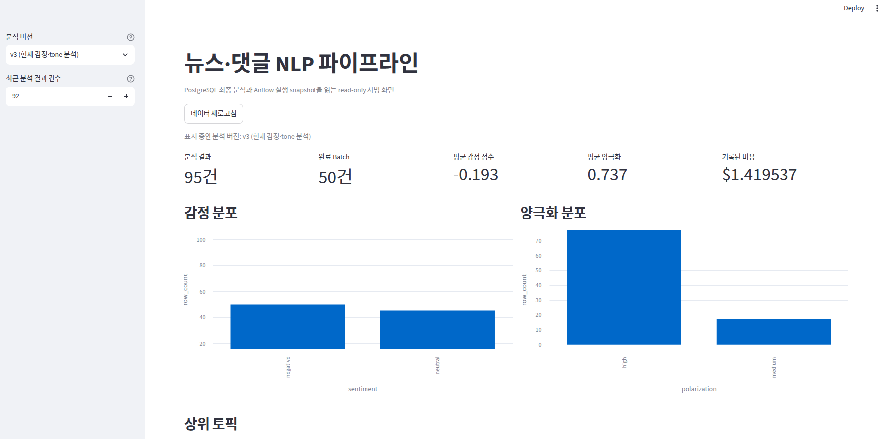
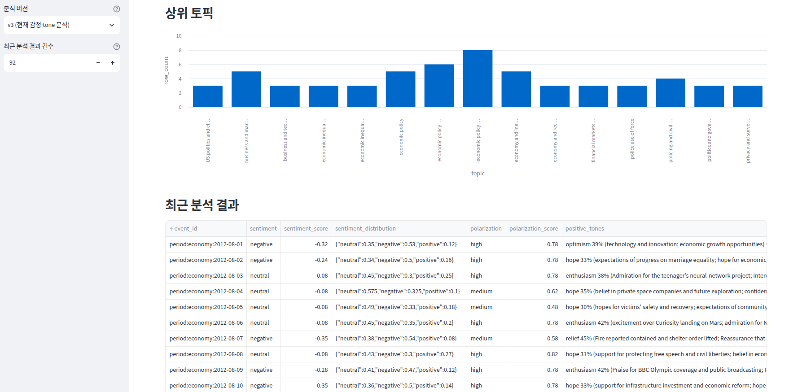

# 뉴스 및 댓글 NLP 데이터 파이프라인

영어 뉴스 제목과 Reddit 댓글을 같은 데이터 계약으로 수집·정제하고, 날짜와 대주제별로
감정·양극화·세부 정서·토픽을 분석해 조회 가능한 결과로 제공하는 데이터 파이프라인입니다.

## 무엇을 해결하는가

- 서로 다른 뉴스·댓글 원본을 `TextEvent v1`으로 표준화합니다.
- 날짜별 이벤트를 Kafka에 적재하고, 해당 실행의 정확한 offset 구간만 Spark로 읽습니다.
- Spark로 계약 검사, 품질 판정, 중복 제거와 일별 Parquet 저장을 수행합니다.
- MinIO에 raw·processed·LLM·report 산출물을 분리해 보존합니다.
- OpenAI Batch로 대량 분석 비용을 줄이고 Langfuse로 token·비용을 관측합니다.
- Airflow 한 번의 실행으로 수집부터 PostgreSQL 저장·Slack 알림·최종 읽기까지 연결합니다.
- Streamlit에서 PostgreSQL의 최종 분석 결과를 조회합니다.

## 데이터

| 출처 | 사용 범위 | 분석 텍스트 | 확보·검증 결과 |
|---|---|---|---:|
| Google News | 2012년 영어 검색 결과 | 기사 제목 | 366일 28,994건 |
| Pushshift Reddit Comments | 2012년 archive 중 선정 subreddit | 작성자를 제외한 댓글 본문 | 원본 12개월 239,814,057건 |
| Global Voices | 2012-01-01~2016-02-29 영어 archive | 기사 제목 | Google News 보완 collector 검증 |

기사와 댓글을 사용자 단위로 연결하지 않습니다. 날짜·대주제 단위로 집계하며, 뉴스와
댓글이 함께 있을 때 LLM 분석의 출처 비중은 각각 50%입니다. 상세 schema와 저장 모델은
[TextEvent v1](docs/architecture/data-contract.md)과
[PostgreSQL 저장 구조](docs/architecture/storage-schema.md)에 있습니다.

## 현재 파이프라인

최종 Airflow DAG는 수집 결과를 Kafka `raw-text`에 먼저 발행한 뒤, 발행 전·후 offset을
기록하고 그 구간만 Spark batch로 처리합니다. 같은 토픽에 다른 실행이 섞여도
`pipeline_run_id`와 날짜로 다시 필터링하며 계약 오류는 `raw-text-dlq`로 보냅니다.


- [구성도 HTML](docs/architecture/system-architecture.html)
- [현재 전체 실행 방법](docs/guides/end-to-end-execution.md)
- [최신 end-to-end 실행 기록](docs/reports/latest-end-to-end-run.md)

## 저장 결과 읽기

Streamlit은 PostgreSQL의 분석 결과를 읽으며 기본적으로 최신 v3 schema만 보여줍니다.
분석 버전과 최근 조회 건수는 화면에서 변경할 수 있습니다.





## 빠른 실행

```bash
docker compose up -d postgres minio kafka
docker compose --profile serving up -d dashboard
export AIRFLOW_UID="$(id -u)"
docker compose -f infra/airflow/docker-compose.airflow.yml up -d
```

- Airflow: `http://localhost:8082`
- Streamlit: `http://localhost:8501`
- MinIO Console: `http://localhost:9101`

Airflow에서 `news_comment_end_to_end_pipeline`을 열고 날짜, 대주제, 실제 제출 여부를
설정해 Trigger합니다. OpenAI 비용이 발생하지 않는 확인은 `submit=false`, 실제 Batch
분석은 `submit=true`를 사용합니다. 파라미터 설명과 단계별 확인 명령은
[전체 실행 방법](docs/guides/end-to-end-execution.md)을 따릅니다.

## 검증된 결과

| 항목 | 현재 결과 |
|---|---:|
| 최근 Airflow Run 범위 | 2012-11-01~2012-12-31, 61일 (30일+31일 두 차례 실행 합산, Kafka bounded batch 포함, `submit=true` 실제 제출) |
| Kafka 발행 / Spark 매칭 | 197,871 / 197,871건 |
| 같은 topic 다른 실행분 필터링 | 5,228,489건 (`pipeline_run_id`·날짜로 제외) |
| Spark 입력 / 고유 저장 | 197,871 / 197,871건 |
| 계약 거부 / 중복 / DLQ | 0 / 0 / 0건 |
| 뉴스 / Reddit | 5,042 / 192,829건 |
| MinIO processed | 610개 객체, 146,013,304 bytes |
| OpenAI Batch | 61/61 완료, 실패 0건 |
| LLM 입력 / 출력 token | 12,855,377 / 34,642 |
| 해당 Run PostgreSQL 분석 | 61건 |
| 전체 누적 PostgreSQL 분석 | 248건 |
| serving snapshot | 61개 |
| 자동 테스트 | 154개 통과 |

이전 92일 pre-Kafka baseline을 포함한 전체 수치, 장애·복구 기록은
[최신 실행 기록](docs/reports/latest-end-to-end-run.md)에 정리했습니다.

## 부하·장애·복구에서 확인한 것과 아직 보장하지 못하는 것

확인한 것:

| 실험 | 조건 | 결과 |
|---|---|---|
| Spark 저장 직전 강제 실패 | 2012-01 Reddit+News 15,063,050건 입력 | 실패 시 출력 0건, 옵션 제거 후 재실행하면 2,935,785건 처리·저장·고유 ID 일치 |
| PostgreSQL 연결 실패 | 잘못된 포트로 200건 적재 시도 | 장애 직후 0/200건 적재, 정상 포트 복구 후 200/200건, 동일 배치 재실행 후에도 200/200건(중복 0) |
| Kafka→Spark Structured Streaming | 같은 checkpoint로 3회 재시작 | 무입력 재시작 0건 처리, 추가 입력만 정확히 반영, Spark·MinIO 컨테이너 재시작 포함 누락·중복 0건 |
| Kafka 데이터 손실 (이번 30일 실행) | 과거 이벤트 replay 시 Kafka 레코드 timestamp를 원본 사건 시각으로 지정 | topic의 7일 retention이 발행 직후 이미 지난 것으로 판정해 16/30일치 offset이 삭제됨. 원인 수정 후 해당 날짜만 재발행해 30/30 복구 |
| LLM 구조화 출력 모순 (2012-12-03, 31일 Run) | `dominant_sentiment`가 `estimated_sentiment_distribution` 최댓값과 불일치 | 검증 게이트가 4회 재시도 모두 감지해 task 실패, 분포 최댓값으로 보정하는 규칙을 추가해 재발행 없이 31/31 통과 |

전체 수치와 재현 명령은 [Date 6 결과](docs/briefings/date6/date6.md), 이번 실행의
원인·수정·복구 절차는 [최신 실행 기록](docs/reports/latest-end-to-end-run.md)에
있습니다.

아직 보장하지 못하는 것:

- Streaming 실행 중 Driver·Worker 강제 종료, PostgreSQL 적재 도중(연결 시점이
  아니라 쓰기 중간) 연결 끊김은 실행하지 않았습니다.
- OpenAI API 자체의 오류 응답·응답 누락·Batch 만료는 재현하지 않았습니다. 이번에
  실제로 만난 문제는 API 장애가 아니라 정상 응답 안의 값 불일치였습니다.
- Spark는 `local[2]`~`local[4]` 단일 노드 소규모 실행만 검증했고, 분산 클러스터·
  대용량 처리량은 검증 범위 밖입니다.
- MinIO·PostgreSQL은 단일 인스턴스로만 검증했고, 백업·복원과 다중 노드 장애는
  확인하지 않았습니다.

남은 시나리오는 [장애·부하 테스트 계획](docs/planning/failure-and-load-test-plan.md)에서
관리합니다.

## 구현 상태

| 영역 | 상태 |
|---|---|
| Collector, TextEvent 계약 | 구현·실데이터 검증 완료 |
| Kafka bounded batch, Spark batch, DLQ | 최종 DAG 편입·실행 검증 완료 |
| Spark Structured Streaming | 독립 재생·checkpoint 복구 검증 완료 |
| MinIO, PostgreSQL 멱등 저장 | 구현·재시작 검증 완료 |
| OpenAI Batch, Langfuse, Slack | 구현·실제 Batch 검증 완료 |
| Airflow 단일 DAG, Streamlit | 구현·end-to-end 검증 완료 |

## 남은 문제와 다음 단계

- Python 실행환경 고정: 이 저장소는 Python 3.11을 기준으로 하지만 그 버전을 강제하는
  파일이 없어, 3.14 환경에서는 PySpark cloudpickle 비호환으로 Spark 관련 자동 테스트
  3개가 깨집니다(3.11에서는 154개 전부 통과).
- [장애·부하 테스트 계획](docs/planning/failure-and-load-test-plan.md)에 남은 항목:
  Streaming 중 Driver·Worker 강제 종료, DB 적재 도중 연결 끊김,
  LLM API 오류 재현.
- [후속 확장 계획](docs/planning/future-expansions.md)에 정리된 확장: Kafka Streaming
  상시 운영 통합, MinIO→S3 전환, 기사 전문 수집, PostgreSQL 대규모 적재, 분산 object
  storage 백업·복원.
- 이번에 새로 확인한 항목: LLM이 구조화 출력 안에서 서로 다른 필드끼리 모순된 값을
  낼 수 있습니다. 지금은 `dominant_sentiment`/`estimated_sentiment_distribution`
  조합만 자동으로 보정하며, 다른 필드 조합(`sentiment_score` 방향 등)이 모순되면
  여전히 실패로 남습니다.

## 저장소 구조

```text
collectors/       외부 데이터 수집과 TextEvent 변환
core/             데이터 계약과 텍스트 품질 규칙
spark_jobs/       batch·Structured Streaming 작업
storage/          JSONL·PostgreSQL·MinIO adapter
llm_analysis/     Batch 요청 생성과 v3 결과 검증
observability/    Langfuse와 구조화 로그 fallback
notifications/    Slack 완료 알림
orchestration/    Airflow에서 재사용하는 실행 helper
dags/             최종 단일 DAG와 과거 DAG 제외 규칙
serving/          PostgreSQL 조회와 Streamlit 화면
analysis/         데이터 명세·품질 fixture·검증 보고서
docs/             아키텍처·실행 가이드·발표 기록
```

문서 전체 목록: [docs/README.md](docs/README.md)
